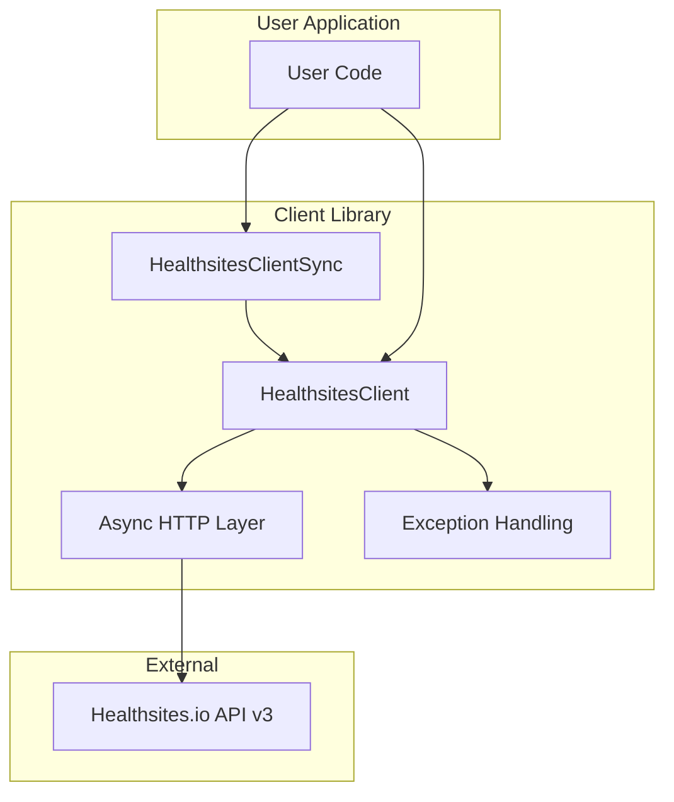

# Healthsites API Client - Technical Specification

## Overview

The Healthsites API Client is a Python library that provides programmatic access to the Healthsites.io API v3. It enables developers to query, create, and update health facility data from OpenStreetMap.

## Architecture

## User Stories

### US-001: List API Endpoints
**As a** developer
**I want to** list all available API endpoints
**So that** I can understand what operations are available

**Acceptance Criteria:**
- [ ] Client provides a `list_endpoints()` method
- [ ] Method returns list of all endpoints with method, path, and description
- [ ] No API call is required (returns static data)

### US-002: List Health Facilities
**As a** developer
**I want to** query health facilities with filters
**So that** I can retrieve facility data for my application

**Acceptance Criteria:**
- [ ] Support pagination via `page` parameter
- [ ] Support filtering by country code
- [ ] Support filtering by bounding box (extent)
- [ ] Support filtering by date range
- [ ] Return GeoJSON feature collection

### US-003: Get Single Facility
**As a** developer
**I want to** retrieve a specific facility by its OSM ID
**So that** I can display detailed facility information

**Acceptance Criteria:**
- [ ] Accept OSM type (node/way/relation)
- [ ] Accept OSM ID
- [ ] Return facility details as GeoJSON feature

### US-004: Create Facility
**As a** developer
**I want to** create new health facilities
**So that** I can contribute to the healthsites database

**Acceptance Criteria:**
- [ ] Accept GeoJSON feature with geometry and properties
- [ ] Return created facility data
- [ ] Handle validation errors appropriately

### US-005: Update Facility
**As a** developer
**I want to** update existing health facilities
**So that** I can correct or enhance facility information

**Acceptance Criteria:**
- [ ] Accept OSM type and ID
- [ ] Accept update data
- [ ] Return updated facility data

### US-006: Get Statistics
**As a** developer
**I want to** get facility statistics
**So that** I can display summary information

**Acceptance Criteria:**
- [ ] Support same filters as list facilities
- [ ] Return statistical summary

### US-007: Download Shapefile
**As a** developer
**I want to** download facility data as shapefile
**So that** I can use it in GIS applications

**Acceptance Criteria:**
- [ ] Accept country code
- [ ] Return shapefile bytes or save to file
- [ ] Support output path parameter

### US-008: Get User Details
**As a** developer
**I want to** get authenticated user details
**So that** I can display user information

**Acceptance Criteria:**
- [ ] Return user details for API key owner

## Functional Requirements

### FR-001: Async-First Design
The library shall be built with async/await as the primary interface, with a synchronous wrapper for convenience.

### FR-002: Error Handling
The library shall provide custom exceptions for:
- Authentication errors (401)
- Not found errors (404)
- Rate limit errors (429)
- Validation errors (400)
- Generic API errors

### FR-003: Type Safety
The library shall include comprehensive type hints for all public methods and return values.

### FR-004: Context Manager Support
The async client shall support use as an async context manager for proper resource cleanup.

### FR-005: Pagination Helper
The library shall provide a convenience method to fetch all pages of results automatically.

## API Endpoints

| Endpoint | Method | Description |
|----------|--------|-------------|
| `/api/v3/facilities/` | GET | List facilities with filters |
| `/api/v3/facilities/` | POST | Create new facility |
| `/api/v3/facilities/statistic/` | GET | Get facility statistics |
| `/api/v3/facilities/{osm_type}/{osm_id}` | GET | Get specific facility |
| `/api/v3/facilities/{osm_type}/{osm_id}` | POST | Update facility |
| `/api/v3/shapefile/{country}` | GET | Download shapefile |
| `/api/v3/user/` | GET | Get user details |

## Testing Requirements

### TR-001: Unit Tests
All public methods shall have unit tests with mocked HTTP responses.

### TR-002: Error Handling Tests
All exception types shall have corresponding tests.

### TR-003: Coverage
Test coverage shall be at least 80%.

## Documentation Requirements

### DR-001: API Reference
All public methods shall have docstrings with parameter descriptions.

### DR-002: Usage Examples
README shall include working code examples.

### DR-003: MkDocs Site
Full documentation shall be available as a static site.

## Version History

| Version | Date | Changes |
|---------|------|---------|
| 0.1.0 | 2026-03-03 | Initial release |

---

Made with love by [Kartoza](https://kartoza.com)
